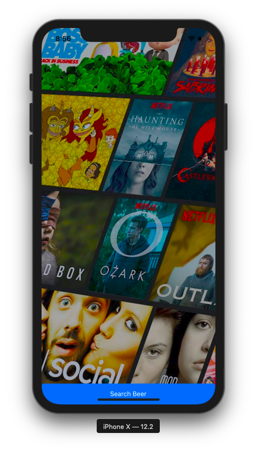
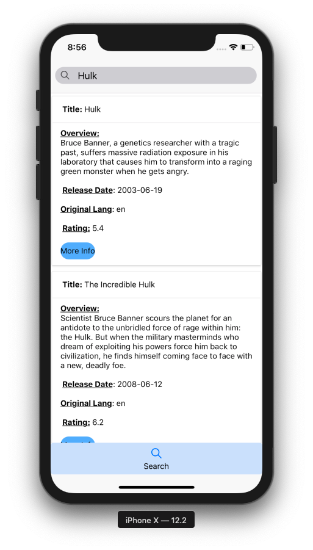
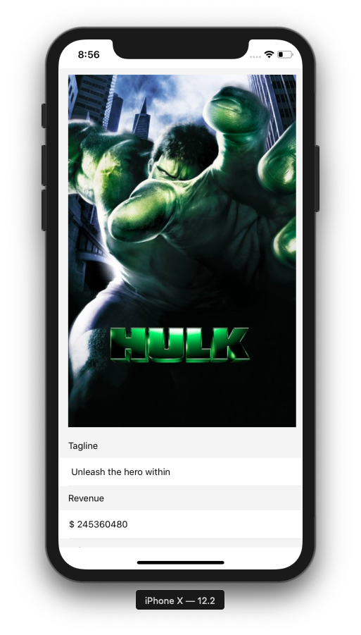
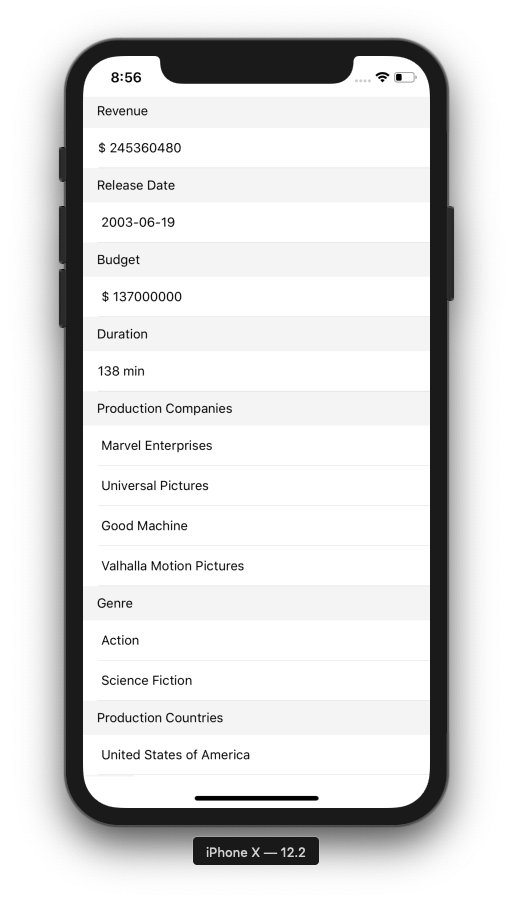

# ReactNative-Movie-Finder

## Generate your own Api key through https://developers.themoviedb.org/3
```javascript
Paste your Api key in SearchTab.js and MovieInfo.js
npm start
```

## To run this App
```javascript
npm i
npm start
```







